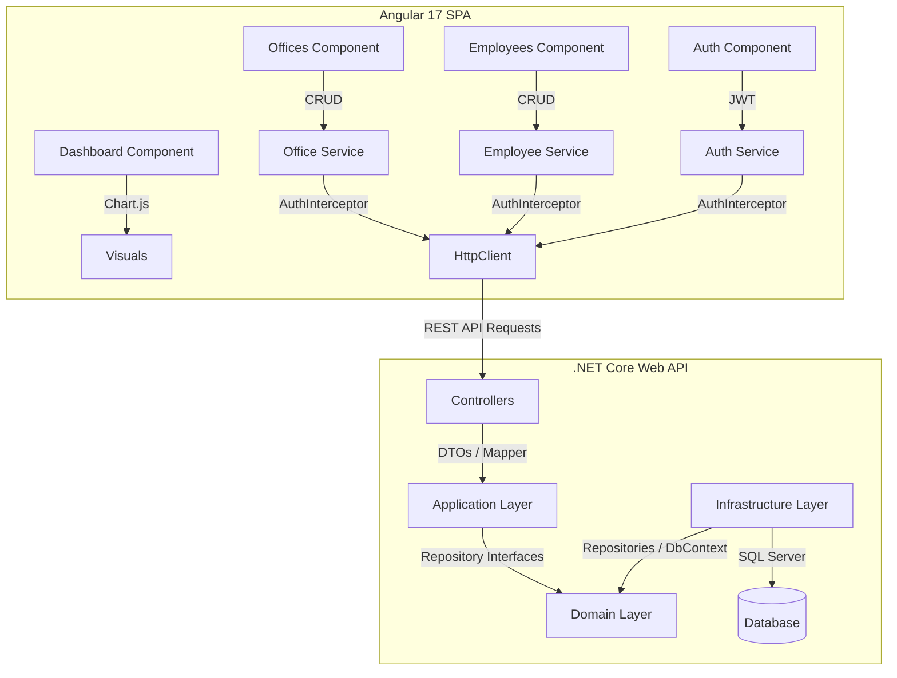

# Office Management System 🏢

A modern, full-stack application built to manage offices and employees. The system consists of a robust **ASP.NET Core Web API** backend conforming to Clean Architecture and a premium, responsive **Angular 17+ Standalone** frontend dashboard.

---

## 🏗️ Project Architecture

The application is split into two main sections:
1. **Backend (`/OfficeManagement`, `/Application`, `/Domain`, `/Infrastructure`)**: Implements an N-Layer Clean Architecture with strict separation of concerns.
2. **Frontend (`/frontend`)**: A standalone Angular 17 SPA with a custom glassmorphism design system.



---

## 🛠️ Technologies Used

### Backend
- **ASP.NET Core 8.0 Web API**
- **Entity Framework (EF) Core** (Code-First)
- **SQL Server**
- **Microsoft Identity** (User Authentication and Role Management)
- **JWT Bearer Authentication**
- **AutoMapper** (DTO Mapping)
- **Swagger/OpenAPI** (API Interactive Documentation)

### Frontend
- **Angular 17** (Standalone Components)
- **Chart.js** (Dynamic Dashboard Graphs)
- **RxJS** & **HttpClient** (Asynchronous stream-based REST communication)
- **CSS3** (Custom global styling featuring Glassmorphism, animations, HSL tailormade colors)

---

## ✨ Features

- 🔐 **Full Authentication**: User Registration and Login with secured JSON Web Tokens (JWT).
- 📊 **Dynamic Dashboard**: High-level statistics counts and an interactive bar chart displaying the distribution of employees per office.
- 🏢 **Office Management**: Create, Read, Update, and Delete (CRUD) operations for offices, showcasing total employees per branch.
- 👥 **Employee Management**: CRUD operations for employees with field validation and dropdown office assignment.
- 🔒 **Route Protection**: Fully protected dashboard and management pages through Angular `AuthGuard` and API `[Authorize]` attributes.
- 💅 **Premium UI/UX**: Sleek dark sidebars, card glassmorphism elements, gradient-colored buttons, form focuses, and page transition micro-animations.

---

## 🚀 Getting Started

### Prerequisites
- [.NET 8.0 SDK](https://dotnet.microsoft.com/download/dotnet/8.0)
- [Node.js](https://nodejs.org/) (v18.x or v20.x recommended)
- [SQL Server Express / LocalDB](https://learn.microsoft.com/en-us/sql/database-engine/configure-windows/sql-server-express-localdb)

---

### 1. Backend Setup (.NET Web API)

1. Navigate to the root directory containing `OfficeManagement.sln`.
2. Open `OfficeManagement/appsettings.json` and configure your SQL Server connection string and JWT properties:
   ```json
   {
     "ConnectionStrings": {
       "DefaultConnection": "Server=(localdb)\\mssqllocaldb;Database=OfficeManagementDb;Trusted_Connection=True;MultipleActiveResultSets=true"
     },
     "JwtSettings": {
       "Key": "YourSuperSecretJWTKey12345!MustBeAtLeast32Bytes",
       "Issuer": "OfficeManagementApi",
       "Audience": "OfficeManagementClient"
     }
   }
   ```
3. Run Entity Framework migrations to create the database:
   ```bash
   dotnet ef database update --project Infrastructure --startup-project OfficeManagement
   ```
4. Start the backend server:
   ```bash
   dotnet run --project OfficeManagement
   ```
   *The server will start and be available at: `https://localhost:7269` and `http://localhost:5112`.*
   *Access Swagger UI at: `https://localhost:7269/swagger` to inspect API endpoints.*

---

### 2. Frontend Setup (Angular 17)

1. Open a new terminal and navigate to the frontend directory:
   ```bash
   cd frontend
   ```
2. Install npm packages:
   ```bash
   npm install
   ```
3. Confirm API endpoint configurations in `src/environments/environment.ts`:
   ```typescript
   export const environment = {
     production: false,
     apiUrl: 'https://localhost:7269/api/'
   };
   ```
4. Run the development server:
   ```bash
   npm start
   ```
5. Open your browser and navigate to **`http://localhost:4200`**.

---

## 🔑 Key API Endpoints

| Category | Method | Endpoint | Description | Auth Required |
| :--- | :--- | :--- | :--- | :--- |
| **Auth** | `POST` | `/api/Auth/register` | Registers a new user | No |
| **Auth** | `POST` | `/api/Auth/login` | Logins a user and returns a JWT | No |
| **Offices** | `GET` | `/api/Offices` | Retrieves all offices | Yes |
| **Offices** | `GET` | `/api/Offices/{id}` | Retrieves a single office by ID | Yes |
| **Offices** | `POST` | `/api/Offices` | Creates a new office | Yes |
| **Offices** | `PUT` | `/api/Offices/{id}` | Updates an existing office | Yes |
| **Offices** | `DELETE` | `/api/Offices/{id}` | Deletes an office | Yes |
| **Employees** | `GET` | `/api/Employees` | Retrieves all employees | Yes |
| **Employees** | `GET` | `/api/Employees/by-office/{officeId}` | Retrieves employees in an office | Yes |
| **Employees** | `POST` | `/api/Employees` | Creates a new employee | Yes |
| **Employees** | `PUT` | `/api/Employees/{id}` | Updates an existing employee | Yes |
| **Employees** | `DELETE` | `/api/Employees/{id}` | Deletes an employee | Yes |

---

## 🔒 Security Implementation

- **JWT Authentication Flow**: The client receives a JWT upon successful login. The Angular `AuthInterceptor` intercepts all outgoing requests and appends the `Authorization: Bearer <Token>` header automatically.
- **Backend Protection**: All controllers (excluding `AuthController`) are decorated with the `[Authorize]` attribute, ensuring the server strictly enforces JWT authentication.
- **Route Guards**: Angular `AuthGuard` handles route protection by analyzing the JWT state, redirecting unauthorized users back to the Login page.
